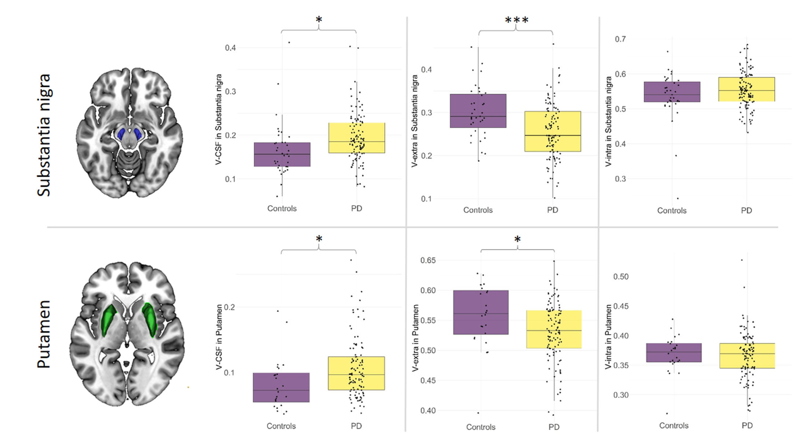
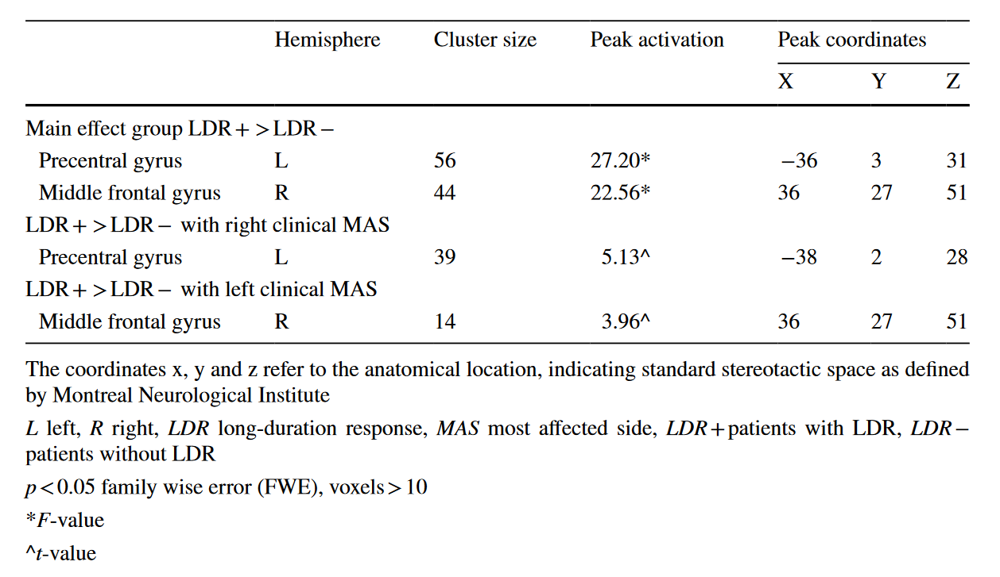
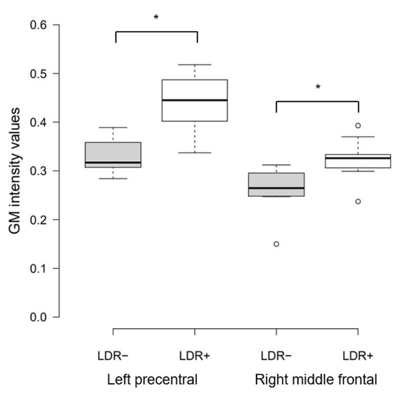
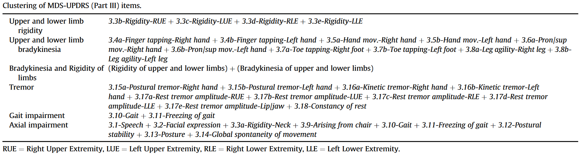
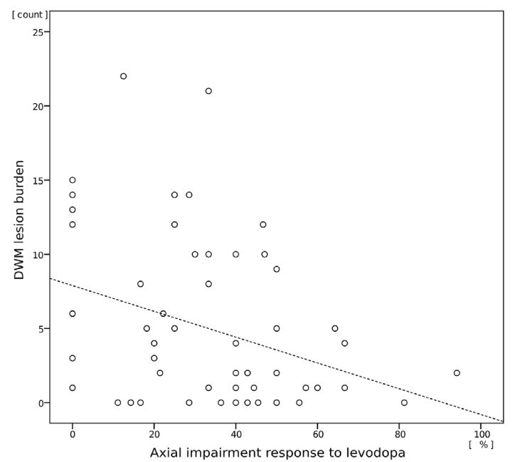
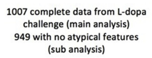
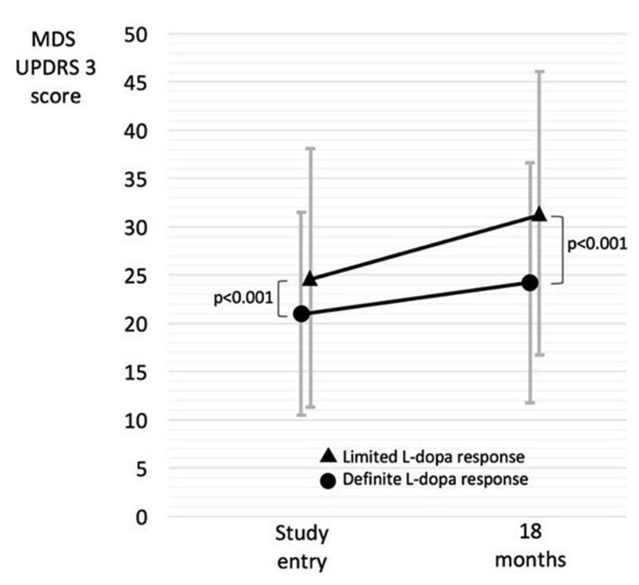
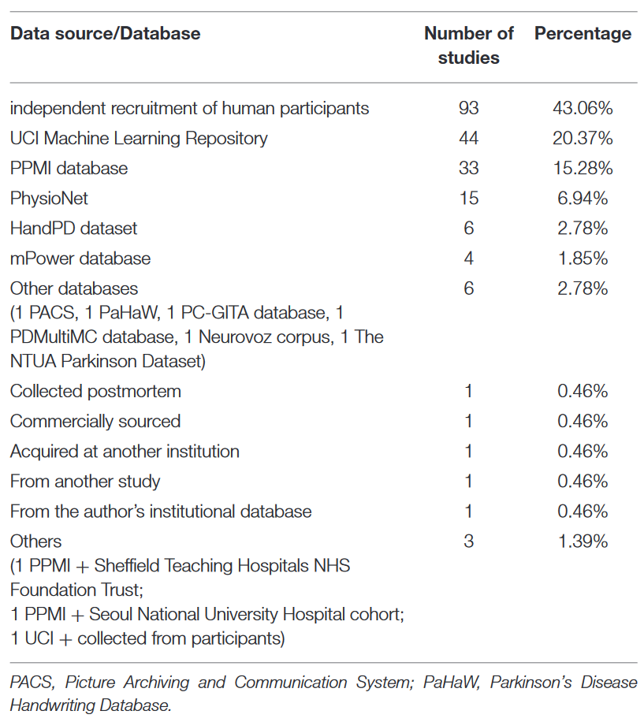
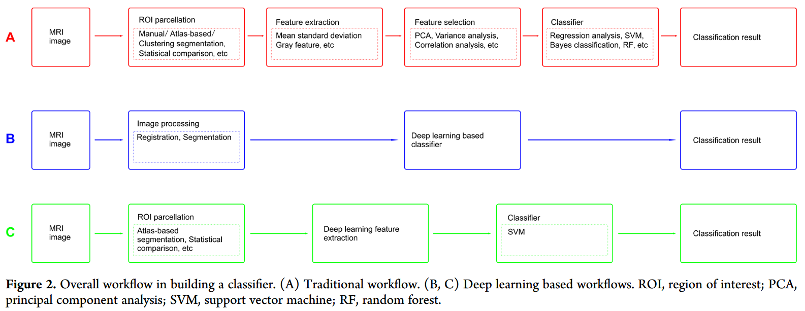
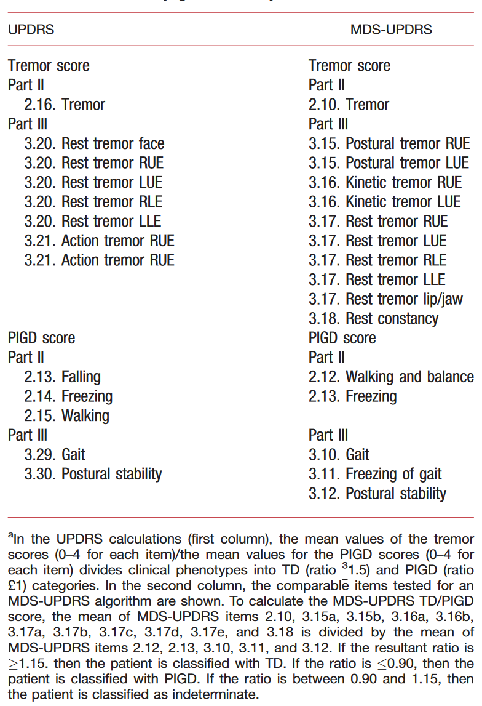

### Prediction

1. [The amplitude of low-frequency fluctuation predicts levodopa treatment response in patients with Parkinson's disease](https://doi.org/10.1016/j.parkreldis.2021.10.003)
   1. N=40-2=38(Two male subjects were excluded due to the presence motion artifacts in the imaging)
   2. Moderate responders(N=21)/Superior responder(N=17)
   3. 通过fMRI计算ALFF(amplitude of low-frequency fluctuation)预测对左旋多巴响应（不使用fMRI故略过具体计算细节）
   4. 患者按照改善率50%的阈值分为两类，两组在年龄、病程、用药时长、左旋多巴等效剂量、OFF状态U3、HAMA、HDRS、MMSE、MoCA评分上无显著差异，在ON状态U3评分存在显著差异
   5. 回归：Ensemble method(SVM，岭回归，线性回归，K近邻回归，AdaBoost，GradBoost)，嵌套交叉验证，无测试集
      1. 输出：改善率
      2. 输入：没有说明，应当包括Table1和fMRI影像特征
      3. 第一层6类模型输出平均概率；第二层使用最小二乘线性回归模型
      4. 10-fold
      5. 计算各特征z-score
      6. 计算各特征与U3评分改善率关联
      7. ANOVA计算p值
      8. PCA从50740个体素中提取特征，保留90%信息
      9. 通过置换检验方式评估各个特征对模型的贡献
      10. r=0.61, MAE=0.11±0.04
      11. 突出的fMRI影像特征包括双侧中央旁回和中央前回、双侧正中扣带皮层、双侧颞叶和枕叶皮层、左侧岛叶皮层、双侧小脑、双侧尾状核和丘脑
   6. 分类：CatBoost，嵌套交叉验证，无测试集
      1. 输出：响应分类
      2. 输入：没有说明，应当包括Table1和fMRI影像特征
      3. 按照0.5的阈值划分左旋多巴响应分类
      4. 10-fold
      5. PCA同上
      6. 使用**随机过采样**方法来保证样本大小平衡
      7. TP=70.6% 12/17, TN=90.5% 19/21, AUC=0.90, Sensitivity 90.0%, Specificity 76.7%, Accuracy 81.7%
      8. Density plot Fig. 4C
      9. 突出的fMRI影像特征包括双侧中央旁回和中央前回、双侧正中扣带回、双侧颞枕叶皮层、双侧小脑和左侧壳核
   7. 数据分析
      1. 临床数据分布(Table 1)
      2. 使用二项式检验对分类模型的准确率、特异性、敏感性进行分析（是否优于随机预测，p<0.05）
   8. 样本量小；无法将患者分为不同症状亚组；没有考虑偏侧症状；没有研究DBS效果
2. **[Regional gray matter changes and age predict individual treatment response in Parkinson's disease](https://doi.org/10.1016/j.nicl.2018.101636)**
   1. N=30
      1. 仅左旋多巴N=5，左旋多巴+多巴胺受体激动剂N=25
   2. 患者被分为响应弱(N=15)/强(N=15)两类（U3评分改变量15.5分作为阈值）
      1. 弱响应组年龄显著高于强响应组
      2. U3评分改变量与年龄显著相关
      3. 多元线性回归（年龄、病程、左旋多巴等效剂量、左旋多巴使用时长）预测U3评分改变量(r2=0.424)
         1. 年龄是唯一显著的预测因子
   3. 通过PD表型分类来与其他研究比较：PIGD(N=22), TD(N=5), intermediate(N=3)
      1. ！通过OFF状态U3评分得到：mean(TD items)/mean(PIGD items)
      2. 三类表型间左旋多巴响应无显著差异
   4. 使用经过**年龄矫正**的灰质密度图
   5. 使用voxel-based分析来研究两组间灰质密度差异，灰质体积、白质体积作为协变量
      1. 强响应与弱响应患者灰质密度在左颞顶盖有显著差异，在响应弱的患者中萎缩更严重
   6. 使用SVM来根据神经影像数据预测响应
      1. 输出：响应分类
      2. 输入：没有说明，灰质密度图（经过年龄矫正/未经年龄矫正）+？
      3. 测试**不同灰质概率二值化模板**的预测性能 Table 2
      4. SVM预测性能：TP: 70.67%, TN: 77.33%, Accuracy: 74.0% Table 2
      5. 通过比较年龄矫正前后分别得到的SVM预测准确率来评估年龄影响
         1. 年龄矫正前：TP: 73.33%, TN: 78.22%, Accuracy: 75.77%
      6. 使用多元线性回归模型（年龄、左旋多巴剂量/使用时长、病程、左侧颞顶盖cluster灰质密度均值）评估临床及影像数据对左旋多巴响应的影响
         1. r2=0.588
         2. 年龄与左侧颞顶盖灰质密度为显著预测因子
   7. 左旋多巴响应不依赖于运动症状严重程度
   8. 年龄比病程与疾病临床进展的关联更强，年龄与左旋多巴响应负相关
   9. 年龄及灰质密度是显著且独立的响应预测指标
3. [Can Dopamine Responsiveness Be Predicted in Parkinson’s Disease Without an Acute Administration Test?](https://content.iospress.com/articles/journal-of-parkinsons-disease/jpd223334)
   1.  N=350
       1.  Patients were enrolled prospectively in 13 specialist centers for movement disorders belonging to a national network (NS-PARK-F-CRIN) in France during their selection for sub-thalamic nucleus deep brain stimulation (DBS), as an ancillary study to the PREDISTIM study
       2.  年龄<75；病程>5；没有严重的意识损伤及痴呆，满足MoCA<24和DSM-IV（精神疾病诊断手册）标准；没有严重的精神障碍；没有手术禁忌症（DBS？）；没有严重的脑萎缩和MRI异常；没有影响短期预后的严重疾病
   2.  T1, T2*
       1.  T1: HCP pipeline
       2.  T1 ROI分割: Volbrain pipeline
       3.  R2\*: niftyfit (T2\*)
   3.  GLCM提取影像纹理及统计学特征（基于ROI 5(T1)+2(T2\*)）
       1.  First-order: 灰度均值，灰度标准差，峰度，偏度
       2.  Second-order: GLCM
           1.  对比度(Contrast)
           2.  熵(Entropy)
           3.  相关性(Correlation)
           4.  方差(Variance)
           5.  Sum-average: relationship between occurrences of pairs with lower intensity values and occurrences of pairs with higher intensity values
           6.  Inverse difference moment: 评估一组连续体素中最大值与最小值的差别
   4.  多元线性回归 **LASSO**
       1.  训练集(N=280, 80%, 10 centers) 测试集(N=70, 20%, 3 centers)
       2.  左旋多巴响应分布不平衡(Fig. 1)，故同时对>0.7的样本测试性能
       3.  Demo_Clinic_Model: 使用**ON state**下的人口统计学和临床数据进行预测
           1.  训练集R2=0.69，测试集R2=0.60
           2.  \>0.7 测试集R2=0.80
           3.  Sex, age, duration, UPDRS2 ON, UPDRS3 ON, UPDRS4, Schwab & England ON
       4.  Demo_Clinic_T1_Model: Demo_Clinic_Model+T1影像提取的特征
           1.  训练集R2=0.76，测试集R2=0.65
           2.  \>0.7 测试集R2=0.82
       5.  Demo_Clinic_R2\*_Model: Demo_Clinic_Model+T2\*影像提取的特征
           1.  训练集R2=0.72，测试集R2=0.60
           2.  \>0.7 测试集R2=0.85
       6.  Demo_Clinic_T1_R2\*_Model: Demo_Clinic_Model+T1影像提取的特征+T2\*影像提取的特征
           1.  训练集R2=0.76，测试集R2=0.55
   5.  测试集R2最大0.65

### Correlation

1. [Disentangling nigral and putaminal contribution to motor impairment and levodopa response in Parkinson's disease](https://doi.org/10.1038/s41531-022-00401-z)
   1. PD108 HC35
      1. (I) 108 consecutive patients with PD who underwent a routine MRI between 01/2018 and 02/2021 for the evaluation of advanced Parkinson therapies or for differential diagnosis and (II) 35 healthy age- and sex-matched controls
      2. Retrospective
   2. DMI(diffusion microstructure imaging)
   3. Voxel-based + ROI-based组间比较
   4. PD与HC在黑质、壳核存在显著差异
   5. 黑质、壳核的微观结构完整性与左旋多巴响应相关（没有参考价值）
   6. 
2. [Levodopa responsiveness and white matter alterations in Parkinson's disease: A DTI-based study and brain network analysis: A cross-sectional study](https://doi.org/10.1002/brb3.2825)
   1. N=54，**PIGD PD**，DTI+左旋多巴冲击试验
      1. Recruited PIGD PD patients from the Department of Neurology, The Second Affiliated Hospital of Chongqing Medical University, China, from January 2017 to December 2020
   2. DTI
      1. Tract-based spatial statistics (TBSS), deterministic tracing (DT), region of interest (ROI) analysis, and automatic fiber identification (AFQ) analyses were performed.
   3. 根据改善率[**30%阈值**](https://doi.org/10.1002/mds.10123)分为两类
   4. 独立样本t检验
   5. voxelwise nonparametric permutation with TFCE correction
   6. Introduction: **PD亚型与患者对左旋多巴响应相关：PIGD响应差，白质损失更严重**
   7. 响应较差的PIGD PD患者存在多区域尤其是胼胝体的**白质**损伤
   8. PD亚型与左旋多巴响应关联
3. [Structural MRI substrate of long-duration response to levodopa in Parkinson's disease: an exploratory study](https://doi.org/10.1007/s00415-021-10550-5)
   1. 左旋多巴长期反应 LDR
   2. N=24
      1. Drug-naïve patients with a new diagnosis of idiopathic PD according to the diagnostic criteria of the UK Parkinson’s Disease Society Brain Bank were enrolled at the Neurologic Clinic of the “University Hospital” in Catania
   3. T1
   4. ANOVA（分类型自变量：LDR+/-，症状主导侧对侧；数值型因变量：灰质密度）
      1. Voxel-wise
      2. ROI-based灰质密度图 (basal ganglia (caudate, putamen, pallidum), supplementary motor area, precentral gyrus, postcentral gyrus, superior, middle and inferior frontal gyri)
   5. 右侧运动症状主导的LDR+患者与左侧中央前回有显著关联，左侧运动症状主导的LDR+患者与右侧额中回有显著关联
      1. 
      2. 
   6. 根据症状主导侧对左右半球分别进行分析，提示潜在的预测特征（PPMI未提供数据）
4. [Influence of white matter MRI hyper-intensities on acute l-dopa response in patients with Parkinson's disease](https://doi.org/10.1016/j.parkreldis.2016.01.017)
   1. N=60
      1. Between January 2012 and August 2014, a consecutive series of subjects with clinical parkinsonism from our outpatient Movement Disorders Clinic were prospectively recruited
   2. WMH (white matter hyperintensities) 白质高信号
      1. MRI影像数据在冲击试验后一年内采集
      2. 两位神经放射学专家使用半定量量表评估WMH
      3. WMH是PD的常见并发症
      4. 指标包括总白质高信号评分(TWMH)，脑室周围空间病变评分(PV)，深部白质评分(DWM)，基底节评分(BG)，幕下空间评分(IT)
   3. 其他数据
      1. 评估时年龄，诊断时年龄，性别，ON/OFF状态U3评分（总分及6个子项）
         1. 上下肢僵硬(Upper and lower limb rigidity)
         2. 上下肢运动迟缓(Upper and lower limb bradykinesia)
         3. 运动迟缓和僵硬(Bradykinesia and Rigidity of limbs)
         4. 震颤(Tremor)
         5. 步态障碍(Gait impairment)
         6. 中轴损伤(Axial impairment)
         7. 
      2. 冲击试验阳性结果：U3评分改善超过30%（后续只使用了改善率）
   4. 非参数 双变量 相关性：
      1. 年龄数据与WMH指标
         1. 评估年龄：PV: R=0.49 p < 0.001; DWM: R=0.31 p < 0.016; BG: R=0.25 p < 0.055; TWMH: R=0.43 p < 0.001
         2. 诊断年龄：TWMH: R=0.31 p < 0.030
      2. 年龄数据与U3评分
         1. 评估年龄：Axial: R=0.30 p < 0.05
         2. 诊断年龄：MDS-UPDRSIII: R=0.34 p < 0.028; Gait: R=0.40 p < 0.007; Axial: R=0.44 p < 0.003
   5. 偏相关分析：年龄作为控制变量
      1. DWM与axial: R=-0.35, p<0.027
      2. 
   6. Deep WMH were associated with worse response to L-Dopa for axial impairment
      1. Worse performance on ratings for speech, facial expression, neck rigidity, rising from a chair, gait, freezing of gait, postural stability, posture and global spontaneous movements
   7. 提示T2影像的作用
5. [L-dopa responsiveness in early Parkinson's disease is associated with the rate of motor progression](https://doi.org/10.1016/j.parkreldis.2019.05.022)
   1. N=1007
      1. Tracking Parkinson's (a prospective observational multicenter study that has recruited from 72 centers in the United Kingdom (UK))
      2. 
      3. 18个月后随访

   2. 特征: 
      1. 人口统计学信息
      2. 诊断特征？-> N=949
      3. 用药史
      4. UPDRS (U3分为ON/OFF)
         1. MDS-UPDRS 3阈值24.5% definite/limited (与UPDRS 3阈值30%等价)

      5. NMSS
      6. REM睡眠行为障碍量表
      7. SCOPA-AUT
      8. [运动表型](https://doi.org/10.1002/mds.25383)
      9. MoCA (经过受教育年限矫正)
      10. 嗅觉减退
      11. 情绪低落和抑郁 (LADS量表)
      12. LEDD
      13. 心血管风险/类风湿性关节炎

   3. Logistic回归预测U3分组
      1. 缺少数据填充：期望值/链式方程多重插补(multiple imputation chained equations approach)

   4. 左旋多巴响应与baseline U3评分和18个月后评分变化率有关
      1. Patients with lower responsiveness to L-dopa have higher motor scores, and faster motor progression
      2. 

6. [l-Dopa responsiveness is associated with distinctive connectivity patterns in advanced Parkinson's disease](https://doi.org/10.1002/mds.27017)
   1. N=19
   2. fMRI on state
   3. Seed-based regression analyses (基底节)
   4. 左旋多巴响应与基底节静息状态下功能连接模式相关
   5. 无参考价值
7. [Which risk factors predict the levodopa response in fluctuating Parkinson's disease?](https://doi.org/10.1002/ana.410270514)
   1. 1990年
   2. N=39
   3. 左旋多巴响应与PD病程和**左旋多巴治疗时长**显著相关
8. [Prediction of the Levodopa Challenge Test in Parkinson's Disease Using Data from a Wrist-Worn Sensor](https://doi.org/10.3390/s19235153)
   1. 偏向硬件，无参考价值
9. [Neurophysiological Predictors of Response to Medication in Parkinson's Disease](https://doi.org/10.3389/fneur.2021.763911)
   1. TMS (Transcranial magnetic stimulation)
   2. 可能需要将LEDD(左旋多巴等效剂量)作为特征加入，PPMI提供了相关数据，但计算可能比较复杂
10. [Levodopa responsiveness in Parkinson's disease: harnessing real-life experience with machine-learning analysis](https://doi.org/10.1007/s00702-022-02540-2)
   1. 左旋多巴长期反应（LDR评估较复杂，但短期左旋多巴响应较简单）
   2. N=296
   3. Consecutive patients with PD attending the outpatient Movement Disorders Unit of Rabin Medical Center from 2000 to 2020 were retrospectively identified by file review
   4. 纳入了有长期随访数据（左旋多巴治疗前后数据）的患者；仅纳入特发性PD患者；排除在随访期间PD诊断发生改变的患者
   5. 采集用药前和用药3个月后的U3评分，改善率>30%为响应良好(N=128)
   6. 白质高信号（没有提及获取方式，可能需要人工评估）(the analysis of the MRI findings was qualitative and not based on scales grading the degree of ischemic changes)
   7. 使用特征：用药前U3评分、用药后U3评分、性别、发病年龄（患者自行报告）、白质高信号、是否使用多巴胺受体激动剂、左旋多巴使用时长、种族、首发症状、运动前症状
   8. 回归分析：对各个变量独立地进行线性回归分析以确定各个变量的相关性，仅包括p<0.05的结果
      1. 女性、年轻时起病、早期使用多巴胺受体激动剂的患者响应较好
      2. 发病年龄，初次使用左旋多巴年龄与左旋多巴响应最相关
      3. 上述两个变量显著相关（r=0.95）
      4. 比较使用A.发病年龄(r2=0.0453)，B.初次使用左旋多巴年龄(r2=0.007)，C.发病年龄及初次使用左旋多巴年龄(r2=0.052)的三类线性模型，模型C中存在显著关联(p=0.012)
      5. 初次使用左旋多巴年龄对左旋多巴响应的影响是否与起病年龄有关(whether the impact of time to levodopa treatment on response to levodopa was related to age at disease onset)
         1. 根据不同的起病年龄分组
         2. 对各组计算左旋多巴响应与初次使用左旋多巴年龄间的斜率
         3. 计算各组间差异的p值
         4. 结果表明起病年龄72岁时的p值最低：对于72岁以下患者，推迟使用左旋多巴年龄对响应影响不大；对于72岁以上患者，提前使用左旋多巴年龄有助于改善左旋多巴响应
      6. 白质高信号：变化较大患者与变化较小患者存在显著差异
   9. 按照对左旋多巴响应进行分层：评分没有变化或恶化；评分改善率<0.3(mild)；评分改善率>=0.3(good)。分析三组中各变量是否存在差异，使用logistic回归对good和mild进行分类
      1. Non-resonders(N=45)/Mild responders(N=123)/Good responders(N=128)
      2. Non-responders起病年龄、初次使用受体激动剂年龄、初次使用左旋多巴年龄均比其他两组大，在使用受体激动剂后改善最小
      3. Good responder中，僵直和运动迟缓是主要的首发症状；Non-responder中震颤是主要的首发症状
      4. Good responder的并发症较少；心血管风险因素是与左旋多巴响应最相关的并发症
      5. 在logistic回归模型中，只有性别存在显著关联
   10. 通过机器学习方法(hierarchical clustering, silhouette score?)对患者进行分层(non-to-mild responders/good responders)
       1. Non-to-mild response(N=227)/Good response(N=69)
       2. 分析结果与按左旋多巴响应一致
   11. good组在用药前评分与mild组没有显著差异，但用药后评分显著下降
   12. 两组间性别和病程分布存在显著差异
11. [Levodopa response differs in Parkinson's motor subtypes: A task-based effective connectivity study](https://doi.org/10.1002/cne.24197)
    1. 亚型 N=26
       1. TD (tremor dominant) N=14
       2. PIGD (postural instability/gait difficulty) N=12

    2. HC 21
    3. 在HC, TD, PIGD间通过任务态fMRI比较皮质-纹状体-丘脑-皮质运动回路激活
    4. OFF状态下，PD患者运动皮层比HC激活程度更低
    5. 用药后，TD患者后壳核与其他区域的连接增强，但PIGD患者未出现

### Review

1. [Machine Learning for the Diagnosis of Parkinson's Disease: A Review of Literature](https://doi.org/10.3389/fnagi.2021.633752)
   1. 2021
   2. PD诊断 （分类）
   3. N=209
      1. Methodology: 132
      2. Clinical Application: 77

   4. 数据来源：
      1. 

   5. 模态 Fig. 3
   6. 样本量
      1. Methodology: 137.1
      2. Clinical Application: 266.2

   7. 模型 N=448
      1. SVM 132
      2. 神经网络 76
      3. 集成学习 82
      4. KNN 33
      5. 回归模型 31
      6. 决策树 28
      7. 朴素贝叶斯 26
      8. 判别分析 discriminant analysis 12
      9. 其他 28

   8. MRI相关 N=36 17.2%
      1. 平均准确率 87.5%，最低准确率70.5%，最高准确率100%
      2. 每项研究中取得最高准确率的模型：
         1. SVM N=21 58.3%
         2. 神经网络 N=3 8.3%
         3. 回归模型 N=2 5.6%
         4. 集成学习 N=1 2.8%
         5. 其他 N=1 2.8%

      3. 8项神经网络相关研究直接使用MRI数据进行分类，其他研究使用从影像中提取的特征（皮层厚度，脑区体积等）
      4. 17项使用PPMI数据集的研究中，16项研究使用准确率评估模型，均值为87.9%
      5. 19项独立采集MRI数据的研究中，16项研究使用准确率评估模型，均值为87.0%

2. [Use of Magnetic Resonance Imaging and Artificial Intelligence in Studies of Diagnosis of Parkinson’s Disease](https://doi.org/10.1021/acschemneuro.9b00207)
   1. 2019
   2. PD诊断，鉴别诊断，分型
   3. 特征提取
      1. 传统上通常根据组间差异提取
      2. 提取疾病相关特征并移除噪声
         1. 尺度不变特征变换(SIFT)
         2. Kendall tau rank correlation coefficient
            1. 有序分类变量相关系数
      3. 在大样本量数据中提取最具辨别能力的特征 Large data sets created a large number of features, so researchers developed novel frameworks to analyze substantial image features
         1. ? JFSS(joint feature-sample selection)
         2. 线性判别分析(LDA)
            1. 将样本投影至直线上进行分类
         3. Multilevel ROI features
            1. 灰质体积、皮层厚度
            2. ROI间连接
      4. 比较不同特征提取方法
         1. Folded concave penalized (FCP) sparse logistic regression  99.7%
         2. PCA  77.8%
   4. 
      1. [Hierarchical Feature Representation and Multimodal Fusion with Deep Learning for AD/MCI Diagnosis](https://doi.org/10.1016%2Fj.neuroimage.2014.06.077)
         1. [Beginners Guide to Boltzmann Machine](https://analyticsindiamag.com/beginners-guide-to-boltzmann-machines/)
3. [The performance of various machine learning methods for Parkinson’s disease recognition: a systematic review](https://doi.org/10.1007/s12144-022-02949-8)
   1. The most common ones are based on Decision Tree (DT), Random Forest (RF), Boosted Trees, XGBoost, Adaboost, K-Nearest Neighbors (K-NN), Linear Discriminant Analysis (LDA), Logistic Regression (LR), Support Vector Machine (SVM), and Naive Bayes (NB)
   2. The performance of RF, SVM, LR are high
4. [The Levodopa Response Varies in Pathologically Confirmed Parkinson's Disease: A Systematic Review](https://doi.org/10.1002/mdc3.12885)
   1. 2020
   2. An excellent response being >30% improvement in Unified Parkinson’s Disease Rating Scale part 3 or ≥ 24.5% improvement in the Movement Disorder Society Unified Parkinson’s Disease Rating Scale part 3
   3. 尽管左旋多巴用量更大，但男性U3评分比女性更差
   4. PIGD亚型响应比TD亚型更差
   5. 年轻患者响应更好
   6. 左旋多巴对10%的PD患者没有效果，对12%的患者效果较差

### UPDRS3 & MDS-UPDRS3

1. [Correlation between the Movement Disorders Society Unified Parkinson’s Disease  rating scale (MDS-UPDRS) and the Unified Parkinson’s Disease rating  scale (UPDRS) during l-dopa acute challenge](https://doi.org/10.1016/j.parkreldis.2011.07.002)
   1. An excellent correlation between UPDRS and MDS-UPDRS and that the 30% of variation in UPDRS score used for predicting sustained long term L-dopa response was equivalent to 24% in MDS-UPDRS
2. [How to identify tremor dominant and postural instability/gait difficulty groups with the movement disorder society  unified Parkinson's disease rating scale: Comparison with the unified  Parkinson's disease rating scale](https://doi.org/10.1002/mds.25383)
   1. 
